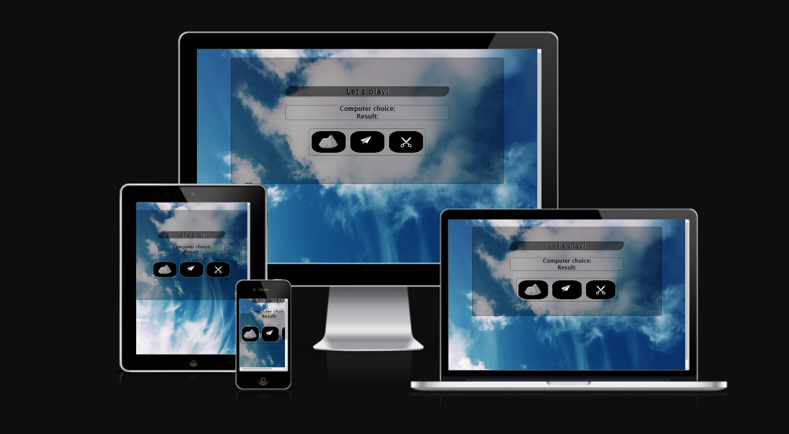
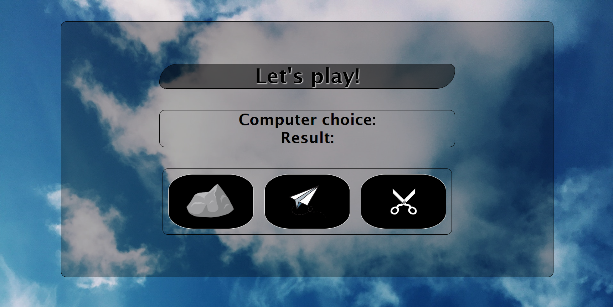
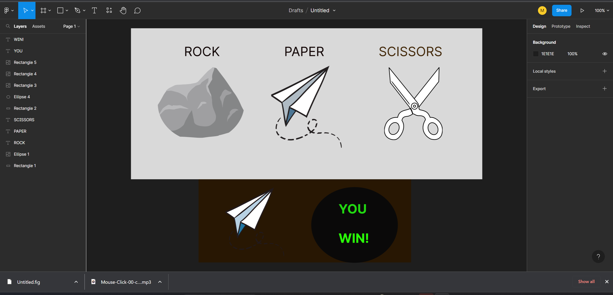

# Rock, paper & scissors: Project 2

A very basic rock paper scissors game that is interactive 
Visit [live website here](https://mickkav.github.io/rock-paper-scissors-project-2/)

## About This Project
This project was intended to provide a RPS that has interactivity and functionality.

### Built with
This project was structured and styled with HTML5 & CSS3 & JavaScript.

### Bugs
- There were numerous bugs in the JavaScript to try and make the documents communicate but with some digging and tutorials, proper notation helped solve the issues.

## Features

- Game Area
    - Where the computer score and the result of your choice is stored.

    

- The Button Area
    - Where the three choices, rock, paper and scissors reside. 
    - The buttons have been styled with a hover pseudo element to create interactivity with the user.

- Our Mission
    - To make a quick game that hasn't any bugs.

- The About section
    - The layout of the game section is with flex box.

    ## Validator testing

- HTML
    - No errors were returned when ran through W3C validator.

- CSS
    - No errors were returned when ran through the officail (Jigsaw) validator.

- JavaScript
    - Unexpected 'const'.
const computerChoiceDisplay = document.getElementById('computer-choice');

- Accessibility
    - I confirmed that colors and fonts that were used were legible and accessible by running through the lighthouse validator in chrome dev tools.

    ## Acknowledgements

 - Stack overflow, W3C, [CSS Tricks](https://css-tricks.com/snippets/css/a-guide-to-flexbox/#aa-flexbox-properties) & freecodecamp were used to source any issues I had with styling, loops or layouts.

 - Images were taken from open source sites such as [Pexels](https://www.pexels.com/)

 ## Testing

- Tested the page using Chrome, FireFox & Explorer.
- Tested for responsiveness via mobile phone and dev tools.

## Deployment

- The site was deployed to GitHub pages. The steps to deploy are:
    - In GitHub repository go to settings
    - From the source section drop-down menu select Main branch
    - Once Main Branch is selected, the page provided the link to the completed website.

## Sketch up
- Figma was used to do a mock-up of lay out of site.

